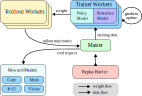
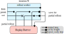

<p align="center">
  
</p>

# Kimi k1.5: Scaling Reinforcement Learning with LLMs

<p align="center">
  <b>Kimi Team</b></a>
</p>


<p align="center">
  <a href="https://kimi.ai/"> <b> Chat   </b></a>
  <a href="k1_5.pdf"><b> Report</b></a>
</p>

Language model pretraining with next token prediction has proved effective for scaling compute but is limited to the amount of available training data. Scaling reinforcement learning (RL) unlocks a new axis for the continued improvement of artificial intelligence, with the promise that large language models (LLMs) can scale their training data by learning to explore with rewards. However, prior published work has not produced competitive results. In light of this, we report on the training practice of Kimi k1.5, our latest multi-modal LLM trained with RL, including its RL training techniques, multi-modal data recipes, and infrastructure optimization.

## Model Performances

- add figures here and a summary of the performance


## Algorithms & Infrastructures

<div style="display: flex; justify-content: space-between;">
  
  
</div>

### Policy Optimization for RL-LLM

- Objective: Train a policy model $\pi_\theta$ to solve problems using a sequence of intermediate steps (Chain of Thought, CoT).
- Policy Optimization: Apply online policy mirror descent to iteratively improve the policy by solving a relative entropy regularized optimization problem.

### Large Scale RL-LLM System
- Iterative Process: Each iteration involves a rollout phase and a training phase.
  - Rollout Phase: Rollout workers generate trajectories by interacting with the model and store them in a replay buffer.
  - Training Phase: Trainer workers use the stored trajectories to update the model's weights.
- Divide Rollout Technique: Manage long and short trajectories by setting a fixed token budget for each rollout. Unfinished long trajectories are saved and continued in the next iteration, ensuring efficient use of computational resources.


## Test Model by API
You can test Kimi k1.5 through the Kimi OpenPlatform. Fill out the test application form in [this link](https://forms.gle/TqZ9XQnPiJPddzhV8). We will contact you via email to provide a test account later.

Here's an example of calling Kimi k1.5
```python
from openai import Client

client = Client(
    api_key="YOUR_KIMI_KEY",
    base_url="https://api.moonshot.ai/v1",
)

messages = [
    {
        "role": "user",
        "content": "The lengths of the two legs of a right triangle are 3 cm and 4 cm respectively. Find the length of the hypotenuse of this right triangle.",
    },
]

stream = client.chat.completions.create(
    model="kimi-k1.5-preview",
    messages=messages,
    temperature=0.3,
    stream=True,
    max_tokens=8192,
)

for chunk in stream:
    if chunk.choices[0].delta:
        if chunk.choices[0].delta.content:
            print(chunk.choices[0].delta.content, end="")

```


## Citation

```
@article{MoonshotAI,
  author = {Kimi Team},
  title = {Kimi k1.5: Scaling Reinforcement Learning with LLMs},
  year = {2025},
}
```
