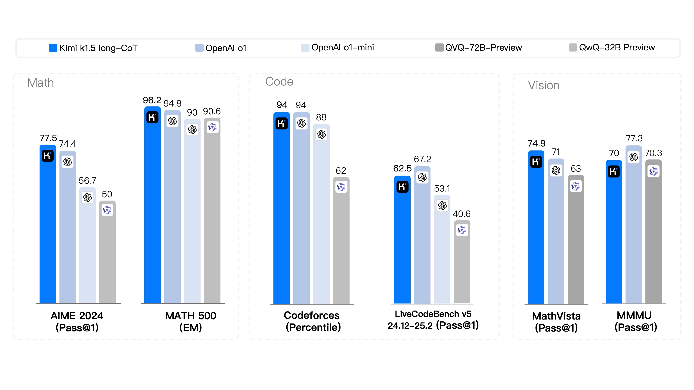

<p align="center">
  <a href="Kimi_k1.5.pdf"></a>
</p>

# Kimi k1.5: Scaling Reinforcement Learning with LLMs

<p align="center">
  <b>Kimi Team</b></a>
</p>


<p align="center">
  <a href="https://arxiv.org/abs/2501.12599"><b> Full Report</b></a>
</p>

🚀 Introducing Kimi k1.5 --- an o1-level multi-modal model

- Sota short-CoT performance, outperforming GPT-4o and Claude Sonnet 3.5 on 📐AIME, 📐MATH-500, 💻 LiveCodeBench by a large margin (up to +550%)
- Long-CoT performance matches o1 across multiple modalities (👀MathVista, 📐AIME, 💻Codeforces, etc)

<p align="center">
  
</p>

<p align="center">
  
</p>


## Key Ingredients of Kimi k1.5

<div style="display: flex; justify-content: space-between;">
  
</div>

There are a few key ingredients about the design and training of k1.5.


- **Long context scaling**. We scale the context window of RL to 128k and observe continued improvement of performance with an increased context length. A key idea behind our approach is to use partial rollouts to improve training efficiency---i.e., sampling new trajectories by reusing a large chunk of previous trajectories, avoiding the cost to re-generate the new trajectories from scratch. Our observation identifies the context length as a key dimension of the continued scaling of RL with LLMs.
- **Improved policy optimization**. We derive a formulation of RL with long-CoT and employ a variant of online mirror descent for robust policy optimization. This algorithm is further improved by our effective sampling strategy, length penalty, and optimization of the data recipe.
- **Simplistic Framework**. Long context scaling, combined with the improved policy optimization methods, establishes a simplistic RL framework for learning with LLMs. Since we are able to scale the context length, the learned CoTs exhibit the properties of planning, reflection, and correction. An increased context length has an effect of increasing the number of search steps. As a result, we show that strong performance can be achieved without relying on more complex techniques such as Monte Carlo tree search, value functions, and process reward models.
- **Mutimodalities**. Our model is jointly trained on text and vision data, which has the capabilities of jointly reasoning over the two modalities.


## Citation

```
@article{team2025kimi,
  title={Kimi k1.5: Scaling reinforcement learning with llms},
  author={Team, Kimi and Du, Angang and Gao, Bofei and Xing, Bowei and Jiang, Changjiu and Chen, Cheng and Li, Cheng and Xiao, Chenjun and Du, Chenzhuang and Liao, Chonghua and others},
  journal={arXiv preprint arXiv:2501.12599},
  year={2025}
}
```
